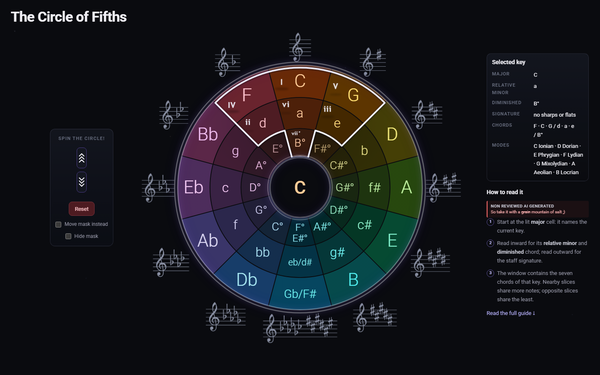

# Circle of Fifths

An interactive circle of fifths for exploring major keys, relative minors, diminished chords, key signatures, diatonic chords, and modes.

**Live demo:** Soon™



## How to use it

Use the dedicated **wheel** or **mask** arrows to move one key at a time. **Reset** returns the view to C. The window frames the selected key's seven diatonic chords: I, ii, iii, IV, V, vi, and vii°. The centre and dashboard read the major key framed by the window, along with its relative minor, diminished chord, signature, chords, and modes.

At the end of the screen there are options to disable the visual effects. The play button plays the selected major scale followed by its diatonic triads; press it again to stop.

The enharmonic meeting point is the sector directly opposite C. Turning clockwise from C adds a sharp at each step; turning counter-clockwise adds a flat. Both directions arrive there at the same pitches after six steps, so that sector carries six sharps and six flats, with both spellings and a combined key signature.

## Running it locally

There is no build step, package manager, or dependency. Serve the repository over HTTP:

```powershell
py -m http.server 4173 --bind 127.0.0.1
```

Then open `http://127.0.0.1:4173/`. The VS Code task **preview: serve** runs the same server.

## Testing

Open `http://127.0.0.1:4173/tests.html` after starting the local server. The standalone test page runs the pure-layer assertions for the key table, angle math, staff layout, and geometry. It deliberately loads only `config.js`, `geometry.js`, and `staves.js`.

Open `http://127.0.0.1:4173/interaction-tests.html` for the browser smoke tests covering wheel and mask movement, Reset, mask visibility, selected-key playback, counter-rotation, and staff accessibility attributes.

## Known limitations

- Pointer dragging is disabled pending an unresolved direction bug.
- The desktop layout has excess whitespace at high display scaling.
- Key signature glyphs are raster images rather than vector artwork.
