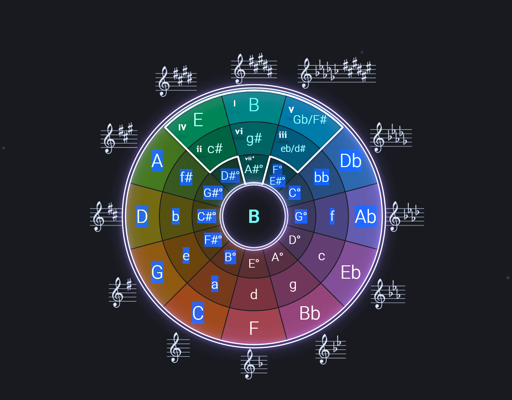

// DONE 1. Add the key degree on each "square" inside the mask: for example in the default C key:
// DONE     - Am: vi
// DONE     - Bdmin: vii° (??)
// DONE     - C: I
// DONE     - Dm: ii
// DONE     - Em: iii
// DONE     - F: IV
// DONE     - G: V

One of the the mask on the circle of fifth's bigger value is that when it moves around, is that the position of the values keeps the same, so we automatically detect all notes, their degree, chord, etc

// DONE 2. Let's review together the animation effects added to the circle, because the only thing I see is the dashed dot rotating slowly.

// DONE 3. Make the mask read as a physical cutout with a compact cast shadow and stronger outside scrim.

// DONE 4. Implement a checkbox to completely hide the mask in the left menu (where you rotate the circle)

// DONE 5. Replace the wheel-rotation hint in the left menu

// DONE 6. Implement a dashboard to the right of the wheel. It lists the currently selected key’s major, relative minor, diminished chord, signature, chords, and possible modes.

// CANCELLED 7. [NOT priority] Nausea mode: Add very low opacity "piece of pizza"-shaped colored surfaces that spin together with the slowly spinnning dashed border we have now. They have to be BARELY visible. Some will rotate like 5% faster or -15% to see if we can actually cause nausea with it. The only way to disable it is to hover the mouse in the lower left corner of the page whnile fully scrolled down. That will reveal the checkbox "Stop the world!!!! I wanna get off" that can then be checked off.

// DONE 8. Make the Circle of Fifths as large as possible in the screen. To show its beauty toi the world, she is so pretty! 🥰 They grow so fast!

// CANCELLED 9. [NOT priority] Ther is a 5% chance that the degreeNumbers will pop away from their places when you rotate (the bug that was happening before some logic on the other direction rotation fixed i)

// DONE 10. Create README.md, list and briefly explain all shading/lighting effects used in the project. Recommendation: dont cite line number but cite variable names (good time to see if they are descriptive enough)

// DONE 11. Add checkboxes to the bottom of the page to disable the mask and wheel glow animations.

// DONE 12. Add a subtle staff drift animation so the signature staves feel less rigid and more natural while the disc is spinning.

// DONE 13. Add a small metronome to the top right corner. Let the user turn it on/off and change bpm, with a mechanical-style swing animation that follows the selected tempo.

// DONE 14. Let the user spin either the disk or the mask by dragging the mouse over the wheel.

// DONE 15. Read, look, think and rewrite the "How to read it" Section. Also in this task find a solution for this element overlap and overcrowd in the main screen 

// DONE 16. Create a background themed in space. It should be very dark, the same color as today, with little movement.

// DONE 17. The metronome movement is completely incorrect. Use your tools to see it and use your web search to read and see how a metronome works. Fix the animation.

// DONE 18. About the mouse spinning: The disk is magnetized in positions that fit it correctly in the mask. It is a strong effect, but while the user is dragging, the effect temporarily concedes.

// DONE 19. (after everything  priority) Review whole project. document features for humands in README.md for robots in whatever .md you kids robots put your diaries.

// DONE 20. REMOVE THE METRONOME from the UI. We will be without a click for a few days. No prob

// DONE 21. Add checkbox to disable all glow
    - Add checkbox to disable mask glow
    - Add checkbox to disable disk glow (inner and outter)

// DONE 22. DOoes that text later on the page even makes sense? Is it fully correct?  You guys cant even understand a metronoome 😂

// DONE 23. Background is an obvious repeating pattern, lets make it better. Something programatic but very low on resources, casuse it is a detail.

// DONE 24. For mobile users: show a muted red play button pinned to the lower right corner.
Playing it will play the scale, then ther chords that are part of that key. Open to discussion on sound synthesis and sound content.

// LATER Home screen house keeping: Adds in the home screen, options to:
// LATER    - Hides the spin menu to the left (becomes a box with a [>])
// LATER    - Hides metronome ([<])
// LATER    - Hides tutorial forever: checkbox and byebye. COokie, localstorage whatever
// LATER    - Hides Relevant info
// LATER    - FEATURE: after hiding everything. an option: "ULTRA CIRCLE" appears -> Makes it so big that you cant even see the claves in the upper and lower ends. Button to reset